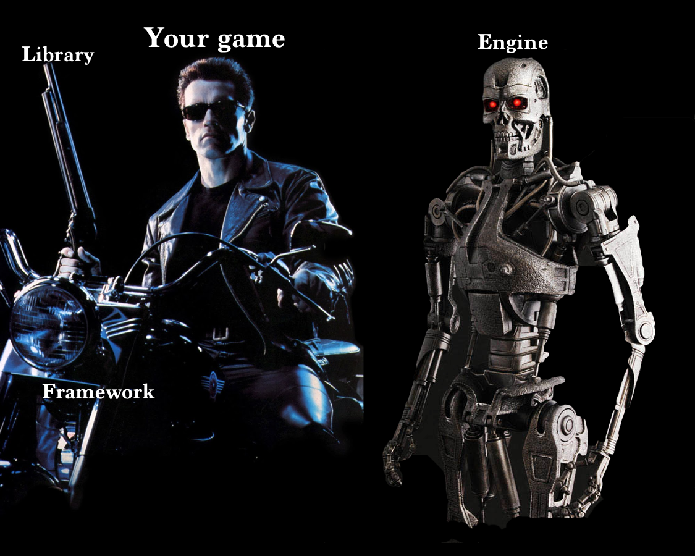

<!-- markdownlint-disable MD001 -->
<!-- markdownlint-disable MD024 -->
<!-- markdownlint-disable MD029 -->
<!-- markdownlint-disable MD033 -->
<!-- markdownlint-disable MD036 -->
<!-- markdownlint-disable MD041 -->
<style>
section {
    font-size: 24px;
}
</style>

# 47th KCLC (コンピュータ部)<br>Pygame 講義 - 1

---

## 前提要件

### Windows

PowerShell がインストールされているか確認！
[インストール方法](https://learn.microsoft.com/ja-jp/powershell/scripting/install/install-powershell-on-windows?view=powershell-7.6)

### Windows, Mac 共通

テキストエディタ（VSCode など）がインストールされているか確認！
[インストール方法（VSCode の場合）](https://code.visualstudio.com/Download)

---

## [uv のインストール](https://docs.astral.sh/uv/getting-started/installation/)

Python をインストールするのに、uv というパッケージマネージャを通します。
仮想環境の構築にデフォルトの `venv` などより使いやすいです。

### Windows

Standalone installer: `powershell -ExecutionPolicy ByPass -c "irm https://astral.sh/uv/install.ps1 | iex"`

### Mac

Standalone installer: `curl -LsSf https://astral.sh/uv/install.sh | sh`

---

## uv の PATH を通す

### Windows

```pwsh
if (!(Test-Path -Path $PROFILE)) {
  New-Item -ItemType File -Path $PROFILE -Force
}
Add-Content -Path $PROFILE -Value '(& uv generate-shell-completion powershell) | Out-String | Invoke-Expression'
```

-> `where uv` で PATH が出たら OK

### Mac

```zsh
echo 'eval "$(uv generate-shell-completion zsh)"' >> ~/.zshrc
```

-> `which uv` で PATH が出たら OK

---

## [Python のインストール](https://docs.astral.sh/uv/guides/install-python/)

`uv python install 3.13`

---

## Git のインストール

### Windows

[GitHub for Windows](https://github.com/apps/desktop) が良いかな？

### Mac

Xcode Command Line Tools から

---

## 環境構築完了！始めよう

```zsh
uv init hello-pygame # カレントディレクトリ下に ./hello-pygame が作られる
code hello-pygame # VSCode など、自身のテキストエディタでフォルダ（./hello-pygame）を開く、エディタから指定しても OK
uv run main.py # 文字が出力される
uv add pygame
# main.py を pygame のサンプルプログラム（下記）に書き換える
uv run main.py # ウィンドウが表示される
```

### pygame のサンプルプログラム

```py
import pygame, sys

pygame.init()
screen = pygame.display.set_mode((640, 480))
pygame.display.set_caption("Hello World")

while True:
   for event in pygame.event.get():
      if event.type == pygame.QUIT:
         pygame.quit()
         sys.exit()
```

---

## Pygame の学習方法

さっき実行した `main.py` のように、Pygame は一つのファイルにプログラムを書いていく方式。
初めはインターネットから拾ってきたり AI とかに書かせたりして、プログラムを変えて遊んでみても良いと思う。

プログラムには APG4b の学習で見慣れた部分もあると思うけど、`pygame.init` 関数とか pygame 固有の機能が他にも多く出てくるから、それに特化した学習が必要になる。
僕としては本がおすすめで、自分の環境（Win or Mac）とか好み（厚さ、雰囲気とか？）、そして最新版の発行ができるだけ新しいものを選ぶと良いと思う。
Web 記事で学習する場合も好みではあるけど、[Pygame超入門](https://python.joho.info/pygame-tutorial/) とかが良いと思う。

---

## Pygame の学習方法

一応、他のゲーム開発ライブラリ（エンジン）もあって、以下のようなものがある。
ただ、Python で開発するなら Pygame が一番良いと思う。

- Unity (C#)
- Unreal Engine (C++, Blueprint)
- DX ライブラリ (C++)
- OpenSiv3D (C++)

---

## 豆知識 - ライブラリ・フレームワーク・エンジン

自分も上手く説明できないんですが、ライブラリ＜フレームワーク＜エンジンのイメージです。
Unity はゲームエンジン（GUI エディターとかが提供されている）、pygame はゲームライブラリ（自分のソースコードで全て制御）みたいな感じです。


